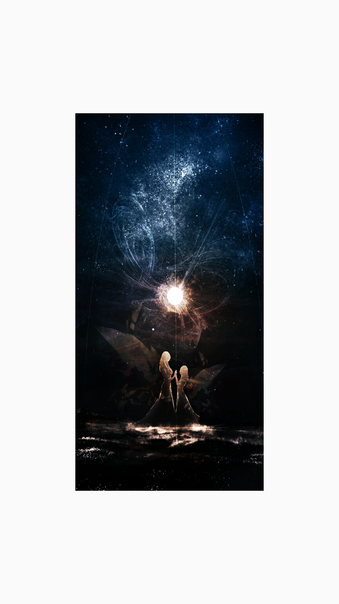

移植java游戏开发框架[libgdx](https://github.com/libgdx/libgdx)到Android平台 ， 移除了 audio ， scenes ，maps ，net ，input模块
删除了一些其他平台的东西 ， 主要目的是为了更方便的在Android端使用OpenGLES API 。


一个简单的使用例子
```java

public class MainActivity extends AppCompatActivity {

    private GLSurfaceView mSurfaceView;

    @Override
    protected void onCreate(Bundle savedInstanceState) {
        super.onCreate(savedInstanceState);
        setContentView(R.layout.activity_main);
        mSurfaceView = findViewById(R.id.surfaceView);
        mSurfaceView.setRenderer(new Renderer(this, mSurfaceView));
        mSurfaceView.setRenderMode(IRenderView.RenderMode.WHEN_DIRTY);
    }


    @Override
    protected void onPause() {
        super.onPause();
        mSurfaceView.onPause();
    }

    @Override
    protected void onResume() {
        super.onResume();
        mSurfaceView.onResume();
    }

    private class Renderer extends Gdx {

        Logger mLogger = new Logger("Renderer", Logger.DEBUG);
        private SpriteBatch mBatch;
        private Texture mTexture;
        private FrameBuffer mFrameBuffer;

        Renderer(Context context, IRenderView renderView) {
            super(context, renderView);
        }


        @Override
        public void create(EglCore egl, EglSurfaceBase eglSurface) {
            super.create(egl, eglSurface);
            mLogger.info("create");
            mFrameBuffer = new FrameBuffer(Pixmap.Format.RGBA8888, getWidth(), getHeight(), false);
            mBatch = new SpriteBatch();
            mTexture = new Texture(files.internal("593522e9ea624.png"));
        }

        @Override
        public void render(EglSurfaceBase windowSurface, Runnable swapErrorRunnable) {
            super.render(windowSurface, swapErrorRunnable);
            mLogger.info("render");

            clear();

            //绘制到frameBuffer
            mFrameBuffer.begin();
            mBatch.begin();
            mBatch.draw(mTexture, 0, 0, getWidth(), getHeight());
            mBatch.end();
            mFrameBuffer.end();

            //绘制到屏幕
            mBatch.begin();
            mBatch.draw(mFrameBuffer.getColorBufferTexture(), 0, 0, getWidth(), getHeight(), 0, 0,
                    mFrameBuffer.getColorBufferTexture().getWidth(),
                    mFrameBuffer.getColorBufferTexture().getHeight(), false, true);
            mBatch.end();

            renderEnd();
        }


        @Override
        public void resize(int width, int height) {
            super.resize(width, height);
            mLogger.info("resize = " + width + "*" + height);
        }

        @Override
        public void resume() {
            super.resume();
            mLogger.info("resume");
        }

        @Override
        public void pause() {
            super.pause();
            mLogger.info("pause");
        }

        @Override
        public void dispose() {
            //before super.dispose();
            mLogger.info("dispose");
            mTexture.dispose();
            mBatch.dispose();
            super.dispose();
        }

    }
}

```
<div>
 
</div>
